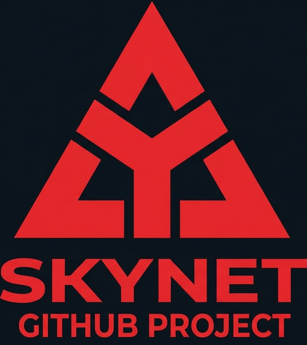

<p align="center">
  
</p>

# Skynet

An autonomous AI development pipeline. Skynet uses LLM agents (Claude Code, OpenAI Codex) as coding workers and bash scripts as the orchestration engine. It claims tasks from a backlog, implements them in isolated git worktrees, runs quality gates, merges on success, and retries failures — shipping code around the clock with zero human intervention.

```bash
npm install -g @ajioncorp/skynet-cli
cd your-project
skynet init
skynet setup-agents
skynet start
```

The pipeline reads your `.dev/mission.md`, generates tasks, and starts implementing them autonomously.

## How It Works

```
                       mission.md
                           |
                    project-driver ---- reads mission + state,
                           |            generates prioritized tasks
                       backlog.md
                           |
                       watchdog -------- every 3 min: dispatch workers,
                           |             crash recovery, health checks
            +--------------+--------------+
            |              |              |
       dev-worker 1       ...       dev-worker N
       1. claim task                (up to 4 parallel)
       2. git worktree
       3. AI agent
       4. quality gates
       5. merge to main
       6. smoke test (opt)
            |                             |
       on failure                    on success
            |                             |
      failed-tasks.md              completed.md
            |
       task-fixer
       retries with error
       context (up to 3x)
```

**The loop:**

1. **project-driver** reads `mission.md` and generates prioritized tasks into `backlog.md`
2. **watchdog** dispatches idle workers, recovers crashes, cleans stale locks, monitors health
3. **dev-worker** claims a task, creates an isolated worktree, invokes the AI agent, runs quality gates, and merges to main
4. **task-fixer** retries failed tasks with full error context (logs, diffs, gate output) up to `SKYNET_MAX_FIX_ATTEMPTS` before marking as blocked
5. When the backlog runs low, project-driver generates the next batch

## Setup

### Prerequisites

| Requirement | Version | Check |
|-------------|---------|-------|
| macOS or Linux | -- | `uname` |
| Node.js | 18+ | `node -v` |
| Git | Any recent | `git --version` |
| pnpm | 9+ | `pnpm -v` |
| Claude Code CLI | Authenticated | `claude --version` |
| Gemini CLI | Optional | `gemini --version` |

```bash
# Install Claude Code (default AI agent)
npm install -g @anthropic-ai/claude-code
claude  # follow login prompts

# Optional: install Codex as fallback
npm install -g @openai/codex

# Optional: install Gemini as fallback
npm install -g @google/gemini-cli
```

### Initialize

```bash
npm install -g @ajioncorp/skynet-cli
cd ~/projects/my-app
skynet init
```

The wizard asks for project name, directory, dev server command, typecheck command, and install command. It creates:

```
.dev/
├── skynet.config.sh      # Machine-specific config (gitignored)
├── skynet.project.sh     # Project conventions (commit this)
├── mission.md            # Your mission (commit this)
├── backlog.md            # Task queue
├── completed.md          # Completed log
├── failed-tasks.md       # Failed task log
├── blockers.md           # Active blockers
└── scripts/              # Worker scripts (symlinked)
```

Non-interactive mode: `skynet init --name my-app --dir /path/to/project --non-interactive`

### Configure Quality Gates

Gates run in order before any merge. Edit `.dev/skynet.config.sh`:

```bash
export SKYNET_GATE_1="pnpm typecheck"
export SKYNET_GATE_2="pnpm lint"
export SKYNET_GATE_3="pnpm test --run"
```

If any gate fails, the branch is not merged and the task goes to `failed-tasks.md` for retry.

### Set Up Notifications

```bash
# Telegram
skynet config set SKYNET_TG_ENABLED true
skynet config set SKYNET_TG_BOT_TOKEN "your-token"
skynet config set SKYNET_TG_CHAT_ID "your-chat-id"
skynet config set SKYNET_NOTIFY_CHANNELS "telegram"

# Slack
skynet config set SKYNET_SLACK_WEBHOOK_URL "https://hooks.slack.com/..."
skynet config set SKYNET_NOTIFY_CHANNELS "slack"

# Discord
skynet config set SKYNET_DISCORD_WEBHOOK_URL "https://discord.com/api/webhooks/..."
skynet config set SKYNET_NOTIFY_CHANNELS "discord"

# Multiple channels
skynet config set SKYNET_NOTIFY_CHANNELS "telegram,slack,discord"

# Test it
skynet test-notify
```

### Install and Start

```bash
skynet setup-agents    # install LaunchAgents (macOS) or cron jobs (Linux)
skynet start           # load agents and start watchdog
skynet status          # verify everything is running
```

Preview without installing: `skynet setup-agents --dry-run`
Remove workers: `skynet setup-agents --uninstall`

## Usage

### Tasks

```bash
skynet add-task "Add user authentication" --tag FEAT
skynet add-task "Fix login redirect" --tag FIX --description "Redirects to /login instead of /dashboard"
skynet add-task "Critical patch" --tag FIX --position 1   # top priority

skynet run "Add input validation to registration"          # one-shot, no backlog
skynet reset-task "Add user auth"                          # reset failed task
skynet reset-task "Add user auth" --force                  # reset + delete branch
```

### Monitoring

```bash
skynet status              # summary
skynet status --json       # machine-readable
skynet status --quiet      # just health score
skynet watch               # live terminal dashboard
skynet dashboard           # web dashboard on port 3100
skynet metrics             # performance analytics
```

### Logs

```bash
skynet logs                         # list available logs
skynet logs worker --id 1 --follow  # tail worker log
skynet logs fixer --tail 50
skynet logs watchdog --tail 100
```

### Pipeline Control

```bash
skynet pause              # workers finish current task then stop
skynet resume             # restart on next watchdog cycle
skynet stop               # kill all workers
skynet start              # restart everything
```

### Maintenance

```bash
skynet doctor             # diagnostics
skynet doctor --fix       # auto-fix common issues
skynet cleanup            # remove stale worktrees, locks, old logs
skynet validate           # pre-flight checks
skynet config list        # show all config
skynet config set KEY val # change config
skynet config migrate     # add new vars after upgrade
```

### Export / Import

```bash
skynet export --output backup.json
skynet import backup.json
skynet import backup.json --dry-run
skynet import backup.json --merge
```

### Skills

Skills are reusable instructions injected into agent prompts based on task tags. They live in `.dev/skills/` as markdown files.

```bash
skynet add-skill api-design --tags "FEAT,FIX" --description "REST API conventions"
skynet add-skill code-quality --description "General standards"  # universal (all tasks)
skynet list-skills
```

Skill file format:

```markdown
---
name: api-design
description: REST API design conventions
tags: FEAT,FIX
---

## API Design

- Use RESTful naming: plural nouns for collections
- Return { data, error } shape from all endpoints
- Validate request bodies at the handler level
```

Skills with no `tags:` field load for all tasks (universal skills). Comma-separated tags match only when the task tag is in the list. For example, `tags: FEAT,FIX` loads the skill for FEAT and FIX tasks but not INFRA or TEST tasks.

## CLI Reference

| Command | Description |
|---------|-------------|
| `skynet init` | Scaffold `.dev/` directory with config and state files |
| `skynet setup-agents` | Install scheduled workers (LaunchAgents / cron) |
| `skynet start` | Start the pipeline |
| `skynet stop` | Stop all workers |
| `skynet pause` / `resume` | Graceful pause and resume |
| `skynet status` | Task counts, worker states, health score, auth |
| `skynet watch` | Live terminal dashboard |
| `skynet dashboard` | Web admin dashboard |
| `skynet doctor` | Diagnostics and auto-fix |
| `skynet validate` | Pre-flight checks |
| `skynet logs [type]` | View worker logs |
| `skynet add-task <title>` | Add task with `--tag`, `--description`, `--position` |
| `skynet add-skill <name>` | Create skill with `--tags`, `--description` |
| `skynet list-skills` | List skills and tag bindings |
| `skynet reset-task <title>` | Reset failed task (optionally `--force` to delete branch) |
| `skynet run <prompt>` | One-shot task without backlog |
| `skynet cleanup` | Remove stale worktrees, locks, old logs |
| `skynet metrics` | Pipeline performance analytics |
| `skynet config <sub>` | `list`, `get KEY`, `set KEY VALUE`, `migrate` |
| `skynet export` / `import` | Snapshot and restore pipeline state |
| `skynet changelog` | Generate changelog from completed tasks |
| `skynet test-notify` | Test notification channels |
| `skynet completions <shell>` | Generate bash/zsh completions |
| `skynet upgrade` / `version` | Check for updates |

## Configuration

Two config files live in `.dev/`:

- **`skynet.config.sh`** -- Machine-specific (gitignored): paths, ports, secrets, tuning
- **`skynet.project.sh`** -- Project-specific (committed): conventions, context, sync config

### Key Variables

**Core:**

| Variable | Default | Description |
|----------|---------|-------------|
| `SKYNET_PROJECT_NAME` | *(required)* | Lowercase project identifier |
| `SKYNET_PROJECT_DIR` | *(required)* | Absolute path to project root |
| `SKYNET_TYPECHECK_CMD` | `pnpm typecheck` | Typecheck command |
| `SKYNET_INSTALL_CMD` | `pnpm install --frozen-lockfile` | Package install in worktrees |
| `SKYNET_GATE_1` .. `SKYNET_GATE_N` | `pnpm typecheck` | Quality gates (run in order before merge) |

**Workers:**

| Variable | Default | Description |
|----------|---------|-------------|
| `SKYNET_MAX_WORKERS` | `4` | Concurrent dev-worker instances |
| `SKYNET_MAX_FIXERS` | `3` | Concurrent task-fixer instances |
| `SKYNET_MAX_TASKS_PER_RUN` | `5` | Tasks per worker before exit |
| `SKYNET_STALE_MINUTES` | `45` | Kill stuck workers after this |
| `SKYNET_AGENT_TIMEOUT_MINUTES` | `45` | Kill agent after this (0 = unlimited) |
| `SKYNET_MAX_FIX_ATTEMPTS` | `3` | Retries before marking blocked |
| `SKYNET_WATCHDOG_INTERVAL` | `180` | Seconds between watchdog cycles |

**Agents:**

| Variable | Default | Description |
|----------|---------|-------------|
| `SKYNET_AGENT_PLUGIN` | `auto` | `auto`, `claude`, `codex`, `gemini`, or path to custom plugin |
| `SKYNET_CLAUDE_BIN` | `claude` | Claude Code binary |
| `SKYNET_CODEX_BIN` | `codex` | Codex binary |
| `SKYNET_GEMINI_BIN` | `gemini` | Gemini binary |

**Notifications:**

| Variable | Default | Description |
|----------|---------|-------------|
| `SKYNET_NOTIFY_CHANNELS` | `telegram` | Comma-separated: `telegram`, `slack`, `discord` |
| `SKYNET_TG_BOT_TOKEN` | -- | Telegram bot token |
| `SKYNET_TG_CHAT_ID` | -- | Telegram chat ID |
| `SKYNET_SLACK_WEBHOOK_URL` | -- | Slack webhook |
| `SKYNET_DISCORD_WEBHOOK_URL` | -- | Discord webhook |

**Other:**

| Variable | Default | Description |
|----------|---------|-------------|
| `SKYNET_POST_MERGE_SMOKE` | `false` | Enable smoke tests + auto-revert after merge |
| `SKYNET_POST_MERGE_TYPECHECK` | `true` | Validate main still builds after merge; auto-reverts on failure |
| `SKYNET_GIT_PUSH_TIMEOUT` | `60` | Seconds per git push attempt before timeout |
| `SKYNET_SKILLS_DIR` | `$SKYNET_DEV_DIR/skills` | Directory containing skill markdown files |
| `SKYNET_WORKTREE_BASE` | `$SKYNET_DEV_DIR/worktrees` | Base directory for worker git worktrees |
| `SKYNET_FIXER_IGNORE_USAGE_LIMIT` | `true` | Allow fixers to run even when usage limits are hit |
| `SKYNET_DEV_PORT` | `3000` | Base dev server port (workers offset from this) |
| `SKYNET_BRANCH_PREFIX` | `dev/` | Feature branch prefix |
| `SKYNET_MAIN_BRANCH` | `main` | Target merge branch |
| `SKYNET_HEALTH_ALERT_THRESHOLD` | `50` | Alert when health drops below this |

### Worker Context

`SKYNET_WORKER_CONTEXT` in `.dev/skynet.project.sh` is injected into every agent prompt:

```bash
SKYNET_WORKER_CONTEXT="
# Project Conventions
- Next.js 15 App Router with TypeScript strict mode
- Tailwind CSS for styling
- Prisma ORM — schema at prisma/schema.prisma
- API routes return { data, error } shape

# Commands
- Dev server: pnpm dev (port 3000)
- Type check: pnpm typecheck
- Tests: pnpm test
"
```

## Agent Plugins

| Plugin | Value | Description |
|--------|-------|-------------|
| `auto` | `SKYNET_AGENT_PLUGIN=auto` | Claude first, Codex fallback, then Gemini |
| `claude` | `SKYNET_AGENT_PLUGIN=claude` | Claude Code only |
| `codex` | `SKYNET_AGENT_PLUGIN=codex` | OpenAI Codex only |
| `gemini` | `SKYNET_AGENT_PLUGIN=gemini` | Google Gemini only |
| `echo` | `SKYNET_AGENT_PLUGIN=echo` | Dry-run (no LLM calls, placeholder commits) |

### Custom Plugin

Create a bash script with `agent_check` and `agent_run` functions:

```bash
#!/usr/bin/env bash
# scripts/agents/my-agent.sh

agent_check() {
  command -v my-ai-tool &>/dev/null
}

agent_run() {
  local prompt="$1"
  local log_file="${2:-/dev/null}"
  echo "$prompt" | my-ai-tool --auto >> "$log_file" 2>&1
}
```

```bash
skynet config set SKYNET_AGENT_PLUGIN "/path/to/my-agent.sh"
```

## Dashboard

Web-based admin dashboard built with React + Next.js 15.

```bash
skynet dashboard              # opens on port 3100
skynet dashboard --port 8080  # custom port
```

| Page | Description |
|------|-------------|
| Pipeline | Worker status, manual triggers, live logs |
| Tasks | Backlog management, create tasks |
| Mission | Mission progress, goal completion |
| Monitoring | System health, agent status, metrics |
| Events | Event history with search |
| Logs | Tail worker and system logs |
| Settings | Edit `skynet.config.sh` |
| Workers | Adjust concurrency |

### Embedding in Your App

The dashboard is published as `@ajioncorp/skynet`:

```typescript
// app/api/admin/pipeline/status/route.ts
import { createPipelineStatusHandler, createConfig } from "@ajioncorp/skynet/handlers";

const config = createConfig({
  projectName: "my-app",
  devDir: "/path/to/.dev",
  lockPrefix: "/tmp/skynet-my-app",
});

const { GET } = createPipelineStatusHandler(config);
export { GET };
```

```tsx
// app/admin/page.tsx
import { SkynetProvider, PipelineDashboard } from "@ajioncorp/skynet";

export default function AdminPage() {
  return (
    <SkynetProvider apiPrefix="/api/admin">
      <PipelineDashboard />
    </SkynetProvider>
  );
}
```

## State

Pipeline state lives in SQLite (`.dev/skynet.db`) as the primary source of truth. Markdown files are kept in sync for backward compatibility.

| File | Committed | Purpose |
|------|-----------|---------|
| `skynet.db` | No | SQLite database -- tasks, workers, events, blockers |
| `skynet.config.sh` | No | Machine-specific config |
| `skynet.project.sh` | Yes | Project conventions |
| `mission.md` | Yes | Mission definition |
| `backlog.md` | Yes | Task queue (synced from SQLite) |
| `completed.md` | Yes | Completed log (synced from SQLite) |
| `failed-tasks.md` | Yes | Failed log (synced from SQLite) |

**SQLite tables:** `tasks` (unified task state), `workers` (status + heartbeat), `blockers`, `events`, `fixer_stats`

**Task statuses:** `pending` > `claimed` > `completed` / `failed` > `fixing-N` > `fixed` / `blocked` / `superseded`

## Architecture

```
skynet/
├── packages/cli/          @ajioncorp/skynet-cli
│   └── src/commands/      One file per CLI command
├── packages/dashboard/    @ajioncorp/skynet (shared library)
│   ├── src/components/    React components
│   ├── src/handlers/      Factory-pattern API handlers
│   └── src/lib/           Config, parsers, SQLite driver
├── packages/admin/        Reference Next.js 15 admin app
│   └── src/app/           App Router pages + API routes
├── scripts/               Bash pipeline engine
│   ├── _config.sh         Config loader
│   ├── _db.sh             SQLite helpers
│   ├── _agent.sh          Agent plugin abstraction
│   ├── _notify.sh         Notification dispatcher
│   ├── watchdog.sh        Dispatcher + crash recovery
│   ├── dev-worker.sh      Worker (worktree > agent > gates > merge)
│   ├── task-fixer.sh      Failed task retry
│   ├── project-driver.sh  Mission-driven task generator
│   ├── agents/            Agent plugins (claude, codex, echo)
│   └── notify/            Notification plugins (telegram, slack, discord)
└── templates/             Scaffolded by `skynet init`
```

### Concurrency Model

- **SQLite WAL mode** for concurrent reads + single writer (ACID transactions)
- **PID lock dirs** (`/tmp/skynet-{project}-*.lock`) prevent duplicate workers (mkdir is atomic)
- **Git worktrees** provide full filesystem isolation for parallel workers
- **Heartbeat epochs** in the workers table detect stuck processes
- **Graceful shutdown** via SIGTERM -- workers finish current checkpoint before exiting
- **Merge mutex** serializes merges to prevent split-brain

### Developing Skynet

```bash
git clone https://github.com/AjionCorp/skynet.git
cd skynet && pnpm install
pnpm typecheck        # verify compilation
pnpm dev:admin        # dashboard on port 3100
```

## Writing a Good Mission

The mission file (`.dev/mission.md`) drives everything. Tips:

- **Be specific.** "Add user auth" is vague. "JWT auth with email/password login, registration, and password reset" generates focused tasks.
- **Use Current Focus.** The project-driver generates tasks for whatever's in this section first.
- **Define success criteria.** Without these, the pipeline can't know when it's done.
- **Update as you go.** Move completed goals out. Add new focus areas.

Example:

```markdown
# Mission

## Purpose
A task management API with real-time updates and role-based access control.

## Goals
1. REST API for CRUD on tasks, projects, and users
2. WebSocket for real-time updates
3. RBAC (admin, manager, member)
4. PostgreSQL with Prisma ORM

## Success Criteria
1. All CRUD endpoints pass integration tests
2. WebSocket broadcasts verified with automated tests
3. RBAC middleware blocks unauthorized access
4. Migrations run cleanly on fresh database

## Current Focus
Database schema and basic CRUD endpoints first. Simple JWT for now.
```

## Troubleshooting

**Workers stuck:** `skynet doctor` to diagnose. `skynet stop && skynet start` to restart. The watchdog auto-kills workers past the stale threshold.

**Task keeps failing:** Check `skynet logs fixer`. The fixer retries up to 3x with error context. Reset manually: `skynet reset-task "task name" --force`

**Merge conflicts:** The task-fixer auto-detects and rebuilds from fresh main. No manual intervention needed.

**Auth expired:** Run `claude` and follow login prompts. The auth-refresh worker syncs credentials every 30 minutes.

**Dashboard not loading:** Try `skynet dashboard --port 3101`. Verify Node.js 18+.

**Backlog empty:** Expected when all current tasks are done. The watchdog triggers project-driver when tasks drop below threshold. Check `skynet logs watchdog --tail 50`.

**Merge keeps reverting:** Smoke tests are reverting broken merges. Check `skynet logs post-merge-smoke --tail 50`. Disable temporarily: `skynet config set SKYNET_POST_MERGE_SMOKE false`

**Pipeline auto-paused:** Main failed 2 consecutive smoke tests. Fix the issue, then `skynet resume`.

**Slow pipeline:** Reduce concurrency: `skynet config set SKYNET_MAX_WORKERS 2`. Check `skynet metrics`.

## License

MIT
