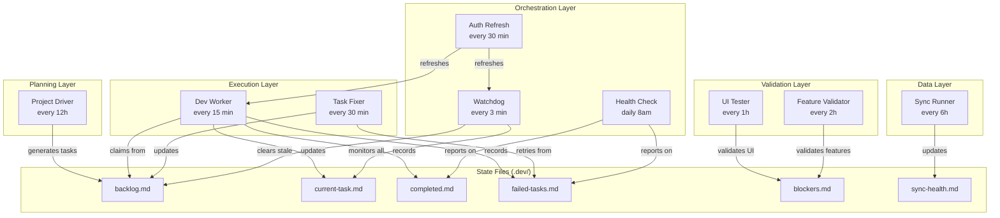

# Pipeline Status

## Architecture Overview

Skynet is an autonomous development pipeline that uses Claude Code as the AI backbone. Workers run on macOS LaunchAgents and coordinate through file-based state in the `.dev/` directory.

## Worker Architecture



## Worker Descriptions

### Watchdog (`watchdog.sh`)
- **Schedule:** Every 3 minutes
- **Purpose:** Monitors pipeline health. Detects stale tasks (claimed but not progressing), clears stuck locks, and ensures workers are responsive. Acts as the pipeline supervisor.

### Auth Refresh (`auth-refresh.sh`)
- **Schedule:** Every 30 minutes
- **Purpose:** Refreshes Claude Code OAuth tokens from the macOS Keychain. Sets an auth-failed flag if credentials are missing or expired, which other workers check before attempting Claude Code invocations.

### Dev Worker (`dev-worker.sh`)
- **Schedule:** Every 15 minutes
- **Purpose:** The primary execution worker. Claims the highest-priority pending task from the backlog, creates a feature branch, invokes Claude Code to implement the task, runs type-checking and linting, then records success or failure.

### Project Driver (`project-driver.sh`)
- **Schedule:** Every 12 hours (8am / 8pm)
- **Purpose:** The planning agent. Reads the project vision, current backlog, completed tasks, and blockers to generate new tasks, re-prioritize existing ones, and maintain the overall development roadmap.

### Task Fixer (`task-fixer.sh`)
- **Schedule:** Every 30 minutes
- **Purpose:** Retries failed tasks. Reads from `failed-tasks.md`, applies incremental fix strategies (up to `SKYNET_MAX_FIX_ATTEMPTS`), and either resolves the task or escalates it to blockers.

### Health Check (`health-check.sh`)
- **Schedule:** Daily at 8am
- **Purpose:** Generates a daily pipeline health report. Summarizes completed tasks, failed tasks, active blockers, sync status, and overall pipeline throughput. Sends a Telegram notification with the summary.

### UI Tester (`ui-tester.sh`)
- **Schedule:** Every 1 hour
- **Purpose:** Runs Playwright smoke tests against the dev server to catch UI regressions. Records failures as blockers if the dev server is unhealthy or critical flows are broken.

### Feature Validator (`feature-validator.sh`)
- **Schedule:** Every 2 hours
- **Purpose:** Runs Playwright feature tests to validate that recently completed tasks actually work end-to-end. Can move tasks back to failed if validation fails.

### Sync Runner (`sync-runner.sh`)
- **Schedule:** Every 6 hours
- **Purpose:** Hits project-defined sync endpoints to refresh data. Updates `sync-health.md` with status, record counts, and error information for each endpoint.

## Pipeline State

| File | Purpose |
|------|---------|
| `backlog.md` | Prioritized task queue. Top = highest priority. |
| `current-task.md` | What the dev-worker is currently working on. |
| `completed.md` | Log of all successfully completed tasks. |
| `failed-tasks.md` | Tasks that failed, with error info and attempt counts. |
| `blockers.md` | Issues that prevent pipeline progress. |
| `sync-health.md` | Status of data sync endpoints. |
| `skynet.config.sh` | Machine-specific config (gitignored). |
| `skynet.project.sh` | Project-specific config (committable). |

## LaunchAgent Status

To check if workers are loaded:
```bash
launchctl list | grep skynet
```

To manually trigger a worker:
```bash
launchctl kickstart gui/$(id -u)/com.skynet.PROJECT_NAME.worker-name
```

To view worker logs:
```bash
tail -f .dev/scripts/worker-name.log
```
